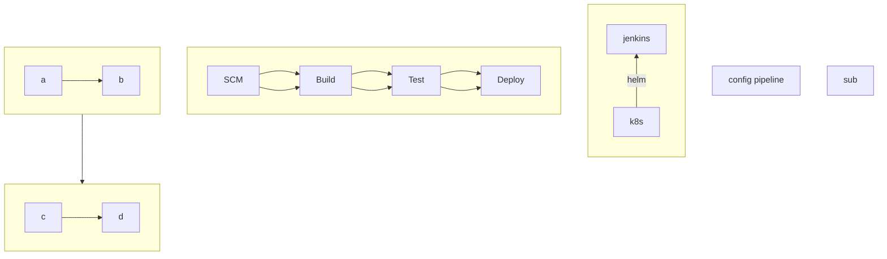

# DevOps-Masterclass

## Flow

```mermaid
flowchart TD
  subgraph AA[&nbsp]
    direction BT
    k8s -- helm --> jenkins
  end
  config[config pipeline]
  subgraph identifier[" "]
    direction LR
    SCM --> Build -->Test --> Deploy
  end
  subgraph B[&nbsp&nbsp]
    direction LR
    c -->d
  end
  subgraph A[&nbsp]
    direction LR
    SCM --> Build -->Test --> Deploy
    a--> b
  end
  A --> B
sub

```

## Commands

- `choco install awscli kubernetes-helm  kubernetes-cli -y`
- `eksctl create cluster --name my-cluster`
- ``
